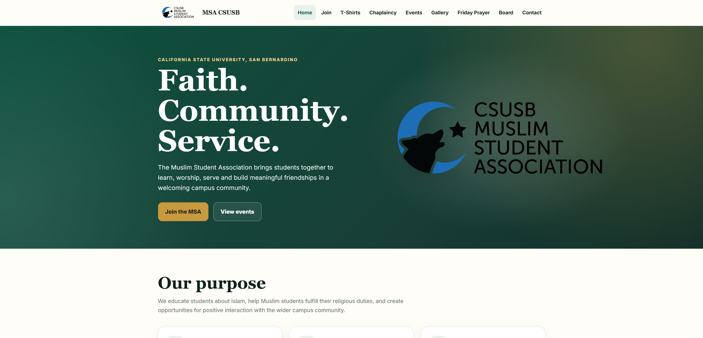

# MSA CSUSB Website

Official website for the **Muslim Student Association (MSA)** at **California State University, San Bernardino**.

🌐 **Live Website:** https://msacsusb.org

  

---

## About

This website serves as the official online presence for MSA CSUSB, providing students and visitors with information about:

- Joining the MSA
- Upcoming events
- Friday Prayer (Jumu'ah)
- Chaplaincy services
- Executive board members
- Photo gallery
- Contact information
- MSA merchandise

The website is designed to be fast, responsive, and easy to maintain.
---

## Credits

Original website created by:

- **Malik Milbes**
- **Amit Lawanghare**

Website redesigned and modernized in 2026 while preserving the original content and mission of MSA CSUSB.

---

## License

This project is maintained for the Muslim Student Association at California State University, San Bernardino.

© MSA CSUSB. All rights reserved.
